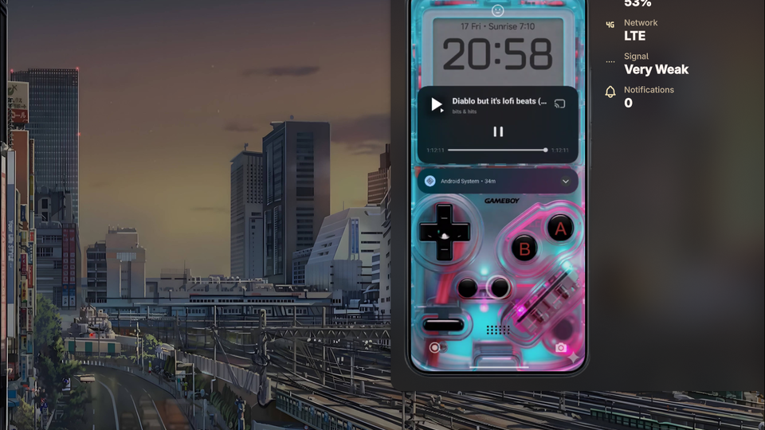
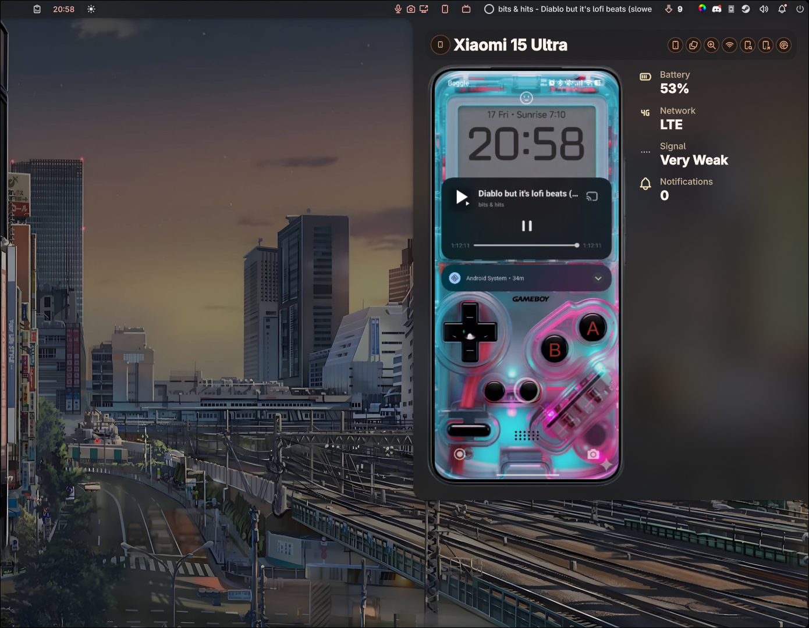
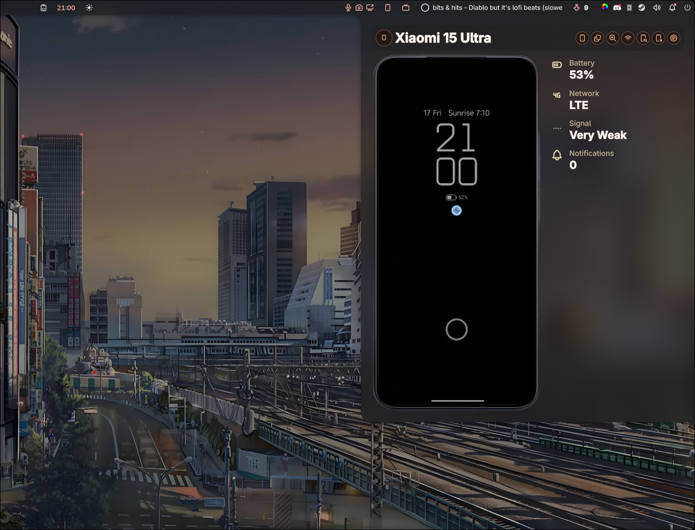
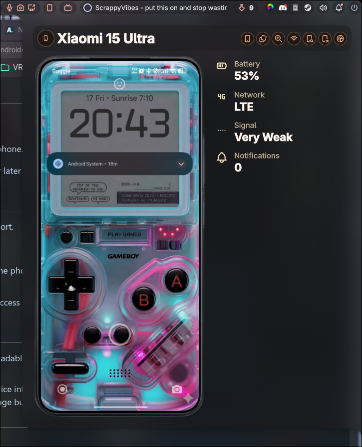

# AndroidConnect

`AndroidConnect` is a Noctalia plugin for Android device status, quick actions, file transfer, and embedded `scrcpy` control inside the panel.

This project is built on top of the original Noctalia `kde-connect` plugin. Credit and thanks to the original Noctalia KDE Connect plugin developers for the base plugin and architecture this work extends.

Upstream base project:
- https://github.com/WerWolv/noctalia-kde-connect

Project repository:
- https://github.com/demencia89/noctalia-shell-androidconnect-plugin

## Screenshots

### Plugin Preview



### Panel Overview



### Lock Screen View



### Panel Close-up



## Current Status

Current plugin version: `1.2.3`

The plugin is currently shaped for real user installs, not just local experimentation.

Current shipped configuration is intentionally small:
- Plugin settings only expose the widget icon color.
- The panel keeps runtime state for phone size, embedded audio, snapshot fallback mode, and remembered Wireless ADB host and port.
- Embedded mirror uses the built-in high-quality profile by default.

Known-good behavior currently preserved:
- Live `Feed` mode works.
- Manual `Fallback` mode is ADB screenshot mode, timer-driven at 80 ms.
- The `Fallback` / `Feed` toggle persists across panel close and reopen.
- The `Fallback` / `Feed` toggle is the left-most button in the top header row.
- The embedded audio toggle is present in the top header row, to the left of the Wi-Fi button.
- Opening the plugin while `scrcpy` is already connected sends unlock-only, not Home.
- The bottom Android nav row stays visible during drawer open and mirror startup, and becomes active when Android input is ready.
- The status/error card hides completely when there is nothing to show.

Recent release-polish changes:
- Removed the fake user-facing mirror/scrcpy settings and kept the embedded mirror path fixed to the built-in high-quality configuration.
- The panel stays in setup/error state instead of trying to auto-start `scrcpy` when ADB is missing, unauthorized, offline, or the loopback feed is not ready.
- Made mirror snapshot and Wireless ADB QR temp files instance-scoped in `/tmp`.
- Made ADB snapshot writes atomic to avoid stale or partially-written preview frames.
- Matched the mobile network icon to the actual reported radio type, including distinct `LTE`, `4G`, and `5G` states.
- Added user-facing notifications when Browse Files or Send File actions fail, so failures are visible instead of disappearing silently.
- Suppressed transient status, warning, and error surfaces for the first 5 seconds after the drawer opens.
- Delayed the embedded mirror fallback suggestion until the drawer has been open for 8 seconds and the live feed is still failing.
- Kept the supported fallback path as snapshot mode only. Overlay fallback was not reintroduced.

## Features

- KDE Connect device list, state, battery, signal, and notification summary
- Browse files, send files, and ring phone from the panel
- Embedded in-panel Android mirror
- Live V4L2 `Feed` mode for the embedded mirror
- Manual snapshot `Fallback` mode for unstable feed environments
- Optional embedded audio toggle, off by default
- ADB tap, swipe, text, key, and Android navigation input
- Wireless ADB pairing and reconnect helpers

## Dependencies

Required for the base plugin:
- Noctalia `>= 4.4.0`
- KDE Connect desktop app and a running `kdeconnectd`
- `busctl` from `systemd`

Required for mirror and Android input features:
- `scrcpy`
- `adb` from Android platform-tools
- Qt Multimedia runtime for your distro, for example `qt6-multimedia`

Required for embedded live `Feed` mode:
- `v4l2loopback`
- A loopback device such as `/dev/video10`
- A loopback label visible to Qt Multimedia, for example `scrcpy-panel`

Required for some optional features:
- `qrencode` for Wireless ADB QR pairing
- `sshfs` and FUSE support for the Browse Files action

Recommended:
- `avahi-browse` for more reliable Wireless ADB service discovery

Not versioned in this repository:
- `settings.json` is local user state and should stay untracked

## Install

1. Copy this plugin directory into your Noctalia plugins directory.
   Example: `~/.config/noctalia/plugins/androidconnect`
2. Reload Noctalia or restart the shell so it picks up the plugin.
3. Enable the plugin in Noctalia.
4. Make sure KDE Connect is installed on both the desktop and phone, then pair the phone normally.

## First-Time Setup

If you want the current default experience, which is embedded `scrcpy` inside the panel:

1. Install `scrcpy`, `adb`, Qt Multimedia, and `v4l2loopback`.
2. On the phone, enable Developer options and USB debugging.
3. Connect the phone over USB once, unlock it, and accept the USB debugging prompt for this computer.
4. Create the V4L2 loopback device used by the embedded live feed.
5. Open the panel.

If ADB or the loopback feed is not ready, the plugin will now stay in setup/error state and tell you what is missing instead of blindly launching a broken mirror session.

## Base Setup

If you only want device status and KDE Connect actions:

1. Confirm `kdeconnectd` is running.
2. Enable the relevant KDE Connect phone-side plugins for battery, notifications, browse files, and remote actions.

## Embedded Mirror Setup

If you want the phone rendered inside the panel:

1. Install `scrcpy`, `adb`, Qt Multimedia, and `v4l2loopback`.
2. Create a V4L2 loopback device.
   Example:

```bash
sudo modprobe v4l2loopback video_nr=10 card_label=scrcpy-panel exclusive_caps=1
```

3. Use `/dev/video10` with a `scrcpy-panel` loopback label, which is the built-in expectation of the current plugin build.
4. Open the panel and start the mirror.

Notes:
- `Feed` is the preferred live mode.
- `Fallback` is the supported manual snapshot mode.
- The `Fallback` / `Feed` toggle is persistent across panel reopen.
- If the feed is unavailable, verify that the loopback device exists, is writable, and matches the configured label.
- If the phone is already mirrored when you open the plugin, AndroidConnect sends unlock-only and does not send Home.

## Wireless ADB Setup

Wireless ADB is optional, but it improves embedded input when USB is not available.

1. Open Android's `Wireless debugging` screen.
2. Use either:
   - `Pair with QR code`
   - `Pair with code`
3. Open the Wi-Fi button in the panel header.
4. After pairing, connect using the ADB port shown on the phone.

The plugin can remember the last successful host and port for later reconnects.

Notes:
- Wireless ADB is optional. USB ADB is still the simplest and most reliable first setup path.

## Browse Files Notes

The Browse Files action depends on KDE Connect's SFTP support.

If it fails:
- Check that the KDE Connect SFTP feature is enabled on the phone.
- Make sure `sshfs` and FUSE support are installed.
- If your file manager is sandboxed, it may not be able to access the mounted path.
- AndroidConnect also shows a notification when Browse Files or Send File fails so the error stays visible while debugging.

## Development Notes

- This repository is intended to host the plugin in a downloadable state for other users.
- Local machine state should not be committed.
- The plugin still uses KDE Connect as its transport and device integration backend. `AndroidConnect` is a renamed and extended plugin package built on top of that foundation.
